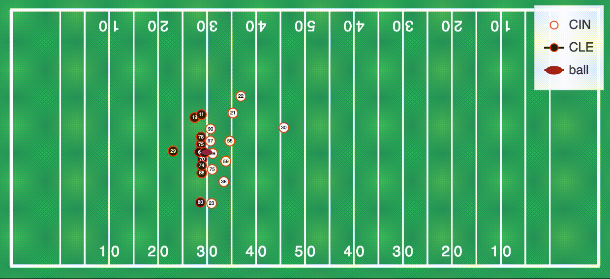

# ptplot
`ptplot` makes it easy to turn player-tracking data into beautiful,
interactive visualizations — including animations! These visualizations can be used to guide
data exploration/analysis work, or to embed in webpages to share with
the world. 



## Installation

`ptplot` can be installed via pip:

```bash
$ pip install ptplot
```

It is strongly recommended that you install `ptplot` into a virtual
environment, such as with [`conda`](https://docs.conda.io/en/latest/):

```bash
[After installing conda]
$ conda create -n player_tracking python=3
$ conda activate player_tracking
$ pip install ptplot
```

You may wish to install some of `ptplot`'s dependencies
via conda, specifically `pandas` and `bokeh`:

```bash
[After installing conda]
$ conda create -n player_tracking python=3 pandas bokeh
$ conda activate player_tracking
$ pip install ptplot
```

## Getting Started

Making your first plot can be as simple as

```python
import pandas as pd

from bokeh.plotting import show

from ptplot import PTPlot
from ptplot.nfl import Field
from ptplot.plot import Positions

data = pd.read_csv("YOUR PLAYER TRACKING DATA")
plot = PTPlot(data) + Field() + Positions("X_COORDINATE_COLUMN", "Y_COORDINATE_COLUMN")
show(plot.draw())
```

For additional documentation and examples, check out the
notebooks in the `notebooks/` directory, which can be viewed
online with all of the plots correctly rendered via nbviewer:
1. [Basic Plots](https://nbviewer.jupyter.org/github/AndrewRook/ptplot/blob/main/notebooks/1-Basic_Plots.ipynb)
2. [Animations](https://nbviewer.jupyter.org/github/AndrewRook/ptplot/blob/main/notebooks/2-Animations.ipynb)
3. [Faceting](https://nbviewer.jupyter.org/github/AndrewRook/ptplot/blob/main/notebooks/3-Faceting.ipynb)
4. [Tips and Tricks](https://nbviewer.jupyter.org/github/AndrewRook/ptplot/blob/main/notebooks/4-Tips_and_Tricks.ipynb)

Additionally, layers within `ptplot` have docstrings with
more usage details. Those can be accessed either by reading the
source code or running `help([FUNCTION])` inside of Python. 

## Development Docs

See [here](development.md)