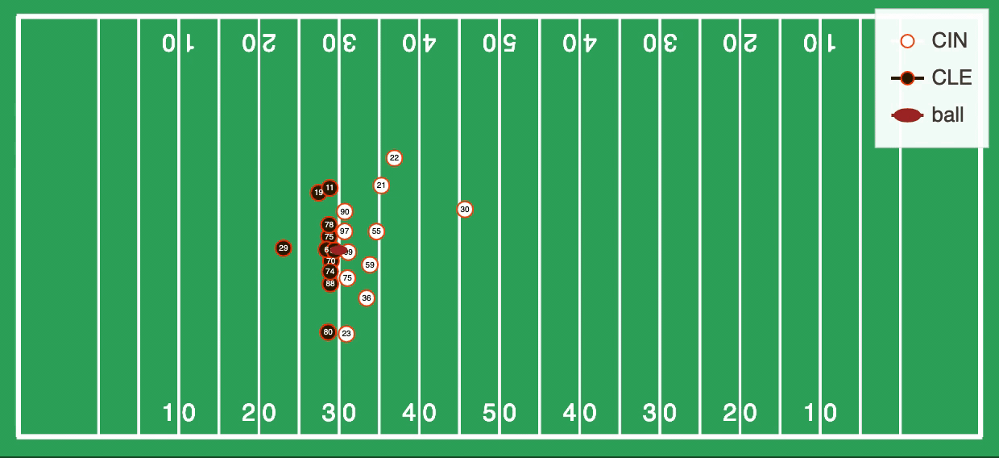

## Development roadmap
* Field generation
  * Figure out how to allow for different sports fields
  * Figure out where to store information about field sizes in data units (also aspect ratios)
  * Figure out how to add to base figure
* Team information
  * Figure out how to allow for different leagues
  * Allow user to override
  * How to store team info for use in plotting
  * Also: the ball
     * custom glyphs?
* Static plots
  * Plot of positions at a certain frame/timestamp
  * Plot of tracks up to a certain frame/timestamp (default: all)
  * Legend by team, clickable to highlight one team or the ball
  * Support for having overlaid plots
  * Support for additional plot types
  * Support for hoverlabels (including handling case with multiple plots)
  * Support for faceting?
  * Support for splitting color/size/etc by column or expression (maybe depends on the plot?)
* Animations
  * Automatically convert static plot to animation by specifying frame/timestamp column  

# ptplot
`ptplot` makes it easy to turn player-tracking data into beautiful,
interactive visualizations — including animations! These visualizations can be used to guide
data exploration/analysis work, or to embed in webpages to share with
the world. 



## Installation

`ptplot` can be installed via pip:

```bash
$ pip install ptplot
```

It is strongly recommended that you install `ptplot` into a virtual
environment, such as with [`conda`](https://docs.conda.io/en/latest/):

```bash
[After installing conda]
$ conda create -n player_tracking python=3
$ conda activate player_tracking
$ pip install ptplot
```

You may wish to install some of `ptplot`'s dependencies
via conda, specifically `pandas` and `plotly`:

```bash
[After installing conda]
$ conda create -n player_tracking python=3 pandas plotly
$ conda activate player_tracking
$ pip install ptplot
```

## Getting Started

Making your first plot can be as simple as

```python
import pandas as pd
from ptplot import plotting
data = pd.read_csv([YOUR PLAYER TRACKING DATA])
fig = plotting.animate_positions(
    data, "x", "y", "frame"
)
fig.show()
```

For additional documentation and examples, check out the
notebooks in the `notebooks/` directory, which can be viewed
online with all of the plots correctly rendered via nbviewer:
1. [Basic Plots](https://nbviewer.jupyter.org/github/AndrewRook/ptplot/blob/main/notebooks/1-Basic_Plots.ipynb)
2. [Animations](https://nbviewer.jupyter.org/github/AndrewRook/ptplot/blob/main/notebooks/2-Animations.ipynb)
3. [Tips and Tricks](https://nbviewer.jupyter.org/github/AndrewRook/ptplot/blob/main/notebooks/3-Tips_and_Tricks.ipynb)

Additionally, functions within `ptplot` have docstrings with
more usage details. Those can be accessed either by reading the
source code or running `help([FUNCTION])` inside of Python. 

## Development Docs

See [here](development.md)